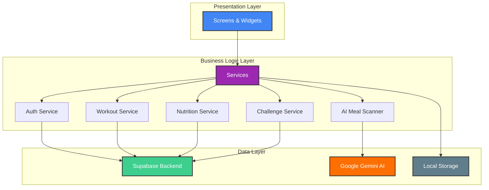
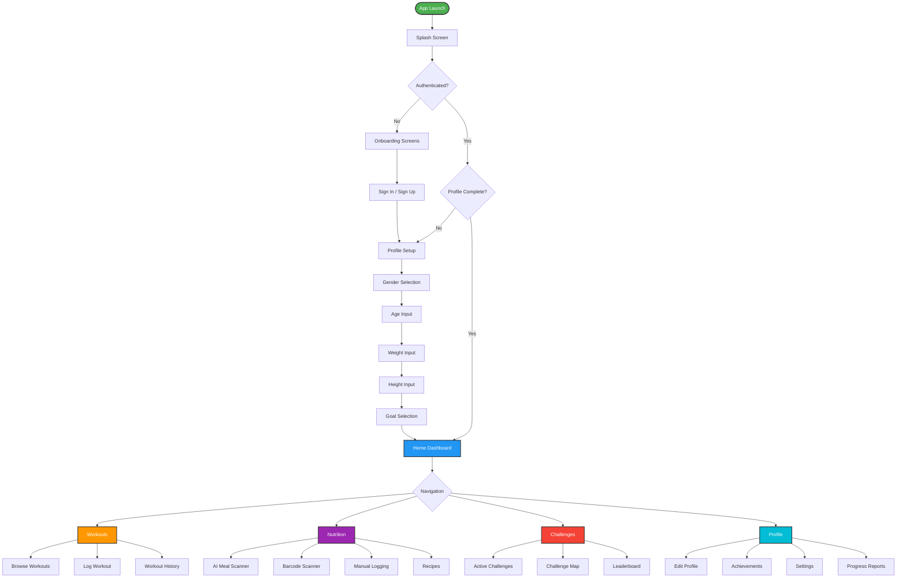
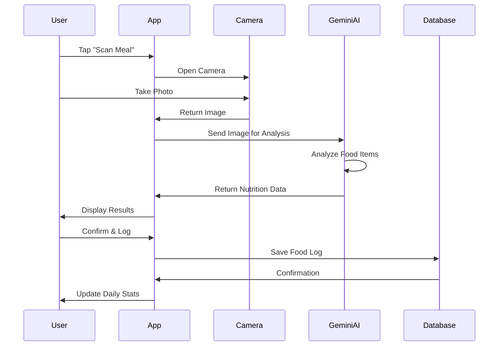
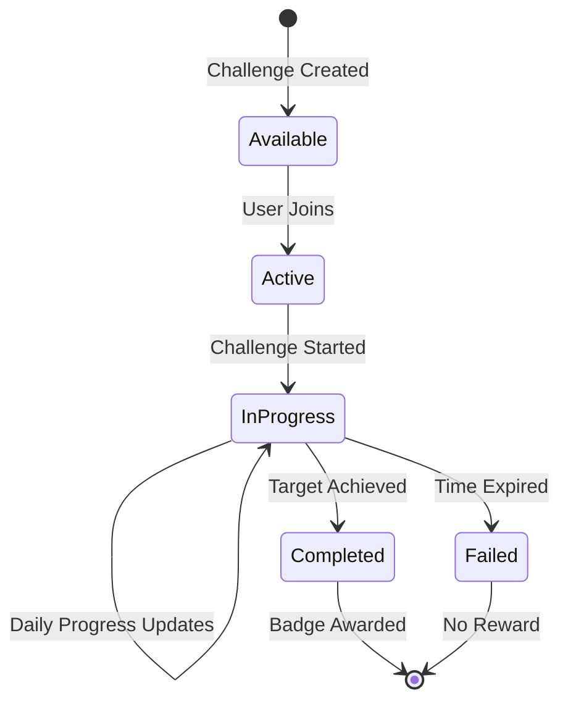
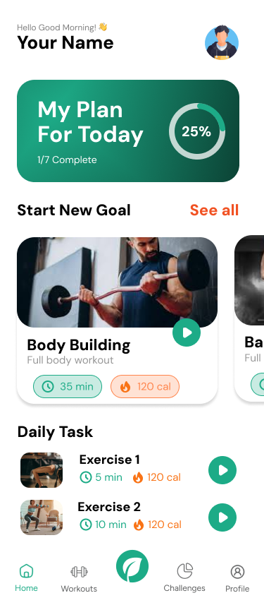
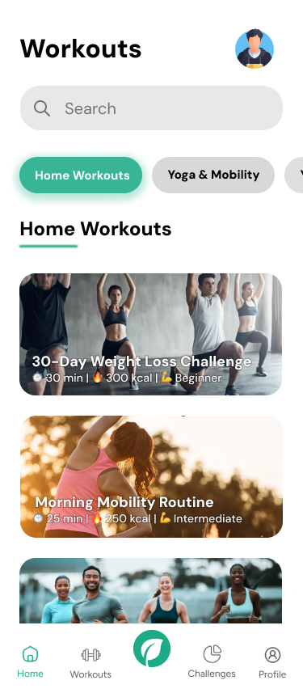
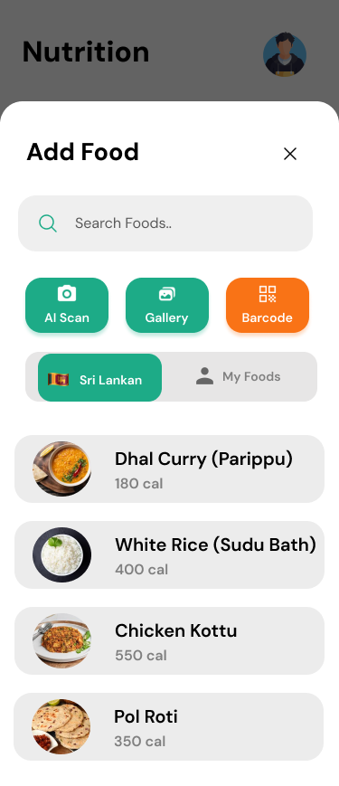
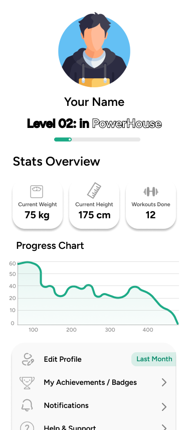

<div align="center">

# 💪 PowerHouse

### Your Ultimate Fitness & Nutrition Companion

[](https://flutter.dev)
[](https://dart.dev)
[](https://supabase.com)
[](LICENSE)

**PowerHouse** is a comprehensive fitness and nutrition tracking application built with Flutter, designed to help users achieve their health goals through intelligent workout tracking, AI-powered meal analysis, gamified challenges, and personalized progress insights.

[Features](#-features) • [Tech Stack](#-tech-stack) • [Getting Started](#-getting-started) • [Architecture](#-architecture) • [Screenshots](#-screenshots) • [Contributing](#-contributing)

</div>

---

## 📱 Features

### 🏋️ **Workout Tracking**
- Browse and search from a comprehensive workout library
- Log workouts with sets, reps, and weights
- **Detailed Workout History**: View all past sessions with date, duration, and calories burned
- **Interactive Progress Charts**: Visualize calorie burn trends over time with dynamic line charts
- **Summary Statistics**: Quick view of total workout sessions, total calories burned, and total time spent
- Video tutorials for proper form
- Goal-based workout recommendations

### 🍽️ **Smart Nutrition Tracking**
- **AI Meal Scanner**: Take a photo of your meal and get instant nutritional analysis powered by Google Gemini AI
- **Barcode Scanner**: Quickly log packaged foods by scanning barcodes
- **Manual Food Logging**: Search and log from an extensive food database
- Track macros (protein, carbs, fats) and calories
- Custom meal creation and recipes
- Daily nutrition goals and progress visualization

### 📊 **Progress Analytics**
- Comprehensive dashboard with key metrics
- Weight tracking with historical charts
- Workout volume and frequency analysis
- Nutrition trends and insights
- Weekly and monthly progress reports
- Calorie burn tracking

### 🏆 **Gamification & Challenges**
- **Badges System**: Earn badges for achievements (Workout Warrior, Cardio King, Iron Lifter, etc.)
- **XP & Levels**: Gain experience points and level up
- **Challenges**: Join time-based challenges (step challenges, workout streaks, etc.)
- **Daily Streaks**: Maintain consistency with streak tracking
- **Leaderboards**: Compete with friends and community

### ✅ **Daily Tasks & Habits**
- Personalized daily task recommendations
- Track water intake, sleep, and other habits
- Smart notifications and reminders
- Task completion tracking with XP rewards

### 💡 **Educational Content**
- Daily fitness tips and nutrition advice
- Exercise tutorials and guides
- Healthy recipes with nutritional information
- Science-backed fitness insights

### 🔔 **Smart Notifications**
- Workout reminders
- Meal logging reminders
- Water intake notifications
- Weekly/monthly progress reports
- Challenge updates

### 👤 **User Profile & Settings**
- Customizable profile with photo upload
- Goal setting (weight loss, muscle gain, maintenance)
- Theme customization (light/dark mode)
- Notification preferences
- Health data integration

---

## 🛠️ Tech Stack

### **Frontend**
- **Flutter** - Cross-platform UI framework
- **Dart** - Programming language
- **Provider** - State management
- **Shared Preferences** - Local storage

### **Backend & Services**
- **Supabase** - Backend as a Service (Authentication, Database, Storage)
- **Google Gemini AI** - AI-powered meal analysis
- **Google ML Kit** - Text recognition for barcode scanning

### **Key Packages**
| Package | Purpose |
|---------|---------|
| `supabase_flutter` | Backend integration |
| `google_generative_ai` | AI meal analysis |
| `google_ml_kit` | ML capabilities |
| `fl_chart` | Data visualization |
| `image_picker` | Photo capture |
| `camera` | Camera access |
| `mobile_scanner` | Barcode scanning |
| `flutter_local_notifications` | Push notifications |
| `health` | Health data integration |
| `youtube_player_flutter` | Video tutorials |
| `font_awesome_flutter` | Icons |
| `lottie` | Animations |
| `shimmer` | Loading effects |

---

## 🚀 Getting Started

### Prerequisites

Before you begin, ensure you have the following installed:
- **Flutter SDK** (3.9.2 or higher) - [Install Flutter](https://flutter.dev/docs/get-started/install)
- **Dart SDK** (3.9.2 or higher)
- **Android Studio** / **Xcode** (for mobile development)
- **Git**

### Installation

1. **Clone the repository**
   ```bash
   git clone https://github.com/Kanishkau4/PowerHouse.git
   cd powerhouse
   ```

2. **Install dependencies**
   ```bash
   flutter pub get
   ```

3. **Configure environment variables**
   
   Copy the example environment file:
   ```bash
   cp .env.example .env
   ```
   
   Open `.env` and add your credentials:
   ```env
   SUPABASE_URL=your_supabase_project_url
   SUPABASE_ANON_KEY=your_supabase_anon_key
   GEMINI_API_KEY=your_gemini_api_key
   ```

4. **Get your API keys**

   #### Supabase Setup
   - Go to [supabase.com](https://supabase.com) and create an account
   - Create a new project
   - Navigate to **Settings** → **API**
   - Copy your **Project URL** and **anon/public key**
   - Set up the database schema (see [Database Setup](#database-setup))

   #### Google Gemini AI
   - Visit [Google AI Studio](https://makersuite.google.com/app/apikey)
   - Create a new API key
   - Copy the API key to your `.env` file

5. **Run the application**
   ```bash
   flutter run
   ```

   Or for a specific platform:
   ```bash
   flutter run -d chrome        # Web
   flutter run -d android       # Android
   flutter run -d ios           # iOS
   ```

---

## 🗄️ Database Setup

PowerHouse uses **Supabase** as its backend. You'll need to create the following tables in your Supabase project:

### Core Tables

| Table | Description |
|-------|-------------|
| `users` | User profiles and settings |
| `foods` | Food database with nutritional info |
| `food_logs` | User meal logging history |
| `recipes` | Custom recipes and meal plans |
| `workouts` | Workout library |
| `workout_logs` | User workout history |
| `exercises` | Exercise database |
| `weight_history` | Weight tracking over time |
| `badges` | Achievement badges |
| `user_badges` | User badge progress |
| `challenges` | Available challenges |
| `user_challenges` | User challenge participation |
| `challenge_progress` | Challenge progress tracking |
| `daily_tasks` | Daily task recommendations |
| `user_tasks` | User task completion |
| `tips` | Educational content |
| `notifications` | Notification history |

### Database Schema

```sql
-- Example schema for users table
CREATE TABLE users (
  id UUID PRIMARY KEY DEFAULT uuid_generate_v4(),
  email TEXT UNIQUE NOT NULL,
  name TEXT,
  age INTEGER,
  gender TEXT,
  weight DECIMAL,
  height DECIMAL,
  goal TEXT,
  xp INTEGER DEFAULT 0,
  level INTEGER DEFAULT 1,
  streak INTEGER DEFAULT 0,
  profile_image_url TEXT,
  created_at TIMESTAMP DEFAULT NOW(),
  updated_at TIMESTAMP DEFAULT NOW()
);

-- Add similar schemas for other tables
-- Refer to your Supabase dashboard for complete schema setup
```

> **Note**: For the complete database schema and migration scripts, please refer to the `database/` folder in the repository (if available) or contact the development team.

---

## 🏗️ Architecture

PowerHouse follows a **clean architecture** pattern with clear separation of concerns:

```
lib/
├── core/                    # Core configurations
│   ├── theme/              # App theming
│   └── constants/          # App constants
│
├── models/                  # Data models
│   ├── user_model.dart
│   ├── workout_model.dart
│   ├── food_model.dart
│   ├── challenge_model.dart
│   └── ...
│
├── services/                # Business logic layer
│   ├── auth_service.dart           # Authentication
│   ├── workout_service.dart        # Workout management
│   ├── nutrition_service.dart      # Nutrition tracking
│   ├── ai_meal_scanner_service.dart # AI meal analysis
│   ├── challenge_service.dart      # Challenges & gamification
│   ├── badge_service.dart          # Badge system
│   ├── daily_tasks_service.dart    # Daily tasks
│   ├── notification_service.dart   # Notifications
│   ├── progress_service.dart       # Progress tracking
│   ├── health_service.dart         # Health data integration
│   └── ...
│
├── screens/                 # UI screens
│   ├── splash/             # Splash screen
│   ├── onboarding/         # Onboarding flow
│   ├── profile_setup/      # Initial profile setup
│   ├── home/               # Home dashboard
│   ├── workouts/           # Workout screens
│   ├── nutrition/          # Nutrition screens
│   ├── challenges/         # Challenge screens
│   ├── tasks/              # Daily tasks
│   ├── profile/            # User profile
│   ├── achievements/       # Badges & achievements
│   └── tips/               # Educational content
│
├── widgets/                 # Reusable UI components
│   ├── custom_button.dart
│   ├── stat_card.dart
│   ├── workout_card.dart
│   └── ...
│
└── main.dart               # App entry point
```

### Architecture Diagram



### User Flow



---

## 🎨 Key Features Deep Dive

### AI Meal Scanner

The AI Meal Scanner uses **Google Gemini AI** to analyze food images and provide detailed nutritional information:



### Challenge System



---

## 📸 Screenshots

<div align="center">
  <table>
    <tr>
      <td><br><sub>Home Screen</sub></td>
      <td><br><sub>Workout Tracking</sub></td>
      <td><br><sub>Meal Scanner</sub></td>
      <td><br><sub>Profile</sub></td>
    </tr>
  </table>
</div>


---

## 🔐 Security & Privacy

- **Environment Variables**: All sensitive keys are stored in `.env` (never committed to Git)
- **Supabase RLS**: Row Level Security policies protect user data
- **Authentication**: Secure email/password and OAuth (Google Sign-In)
- **Data Encryption**: All data transmitted over HTTPS
- **Local Storage**: Sensitive data encrypted on device

### Security Best Practices

- ✅ Never commit `.env` file
- ✅ Rotate API keys if exposed
- ✅ Use Supabase RLS policies
- ✅ Validate all user inputs
- ✅ Keep dependencies updated

---

## 🧪 Testing

```bash
# Run all tests
flutter test

# Run tests with coverage
flutter test --coverage

# Run integration tests
flutter test integration_test
```

---

## 📦 Building for Production

### Android
```bash
flutter build apk --release
# or
flutter build appbundle --release
```

### iOS
```bash
flutter build ios --release
```

### Web
```bash
flutter build web --release
```

---

## 🤝 Contributing

We welcome contributions! Here's how you can help:

1. **Fork the repository**
2. **Create a feature branch**
   ```bash
   git checkout -b feature/amazing-feature
   ```
3. **Commit your changes**
   ```bash
   git commit -m 'Add some amazing feature'
   ```
4. **Push to the branch**
   ```bash
   git push origin feature/amazing-feature
   ```
5. **Open a Pull Request**

### Contribution Guidelines

- Follow the existing code style
- Write meaningful commit messages
- Add tests for new features
- Update documentation as needed
- Ensure all tests pass before submitting PR

---

## 🐛 Known Issues & Roadmap

### Known Issues
- [ ] Notification scheduling on iOS requires additional permissions
- [ ] Some charts may not render correctly on web

### Roadmap
- [ ] Social features (friend system, activity feed)
- [ ] Smartwatch integration (Apple Watch, Wear OS)
- [ ] Meal planning and grocery lists
- [ ] Personal trainer AI assistant
- [ ] Integration with fitness equipment (Bluetooth)
- [ ] Multi-language support
- [ ] Offline mode improvements

---

## 📄 License

This project is licensed under the **MIT License** - see the [LICENSE](LICENSE) file for details.

---

## 👥 Team

**PowerHouse Development Team**

- Lead Developer: [Kanishkau4]
- Contributors: [List contributors]

---

## 🙏 Acknowledgments

- **Flutter Team** for the amazing framework
- **Supabase** for the powerful backend platform
- **Google** for Gemini AI and ML Kit
- **Open Source Community** for the incredible packages

---

## 📞 Support & Contact

- **Issues**: [GitHub Issues](https://github.com/Kanishkau4/PowerHouse/issues)
- **Email**: support@powerhouse.app
- **Documentation**: [Wiki](https://github.com/Kanishkau4/PowerHouse/wiki)

---

<div align="center">

### ⭐ Star this repo if you find it helpful!

**Made with ❤️ and Flutter**

[Back to Top](#-powerhouse)

</div>
